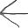
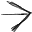
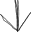
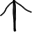

## Introduction

MagneticFloor is a mod that adds a totally new gameplay element, allowing for automation of player movements (and vehicles in the future), based on the conceit of using magnetic levitation to float.

The foundation of Magnetic Floor are the floor tiles known as copper-floor, which gives better bonus than concrete for speed movement bonus. Each successive tier(Level 1:  , Level 2:  , Level 3:   ) of copper floors give better bonus movement. These are the critical pathways for automation of players movements.

To actually move player automatically required a multiple of requisites, some of which required technology research. All tiers copper floor required green and red science, but unlocking the directives and the accelerator required blue science.

First, ensure that the equipment hoverboard ()) is equipped in your power armor and that you are wearing it. If you are doing it correctly, the hoverboard UI (), should appears somewhere around the upper left corner. If not, then you did not correctly equip the hoverboard.

If the button is indicated 'OFF', then you'll need to click on the button to turn on activate navigation. Otherwise, you will not be able to do any automated movements.

Next, you'll need to lay a path of copper flooring from your intended starting location to your intended destination.

Example: Copper Floor pathways

The last component for automated movement are the directives(, , , ) and the accelerator tile(). You'll need to supply electricity to your accelerator in order for the tile to work. The purpose of an accelerator is to charge your hoverboard, providing the energy it needs for automated movement for five seconds, or five ticks. Directive tiles will supply your hoverboard with changes in the direction of your character's movement. Up, down, left, right arrows are what it is said on the tin.

Example: Necessary components for movement.

It is also worth keeping in mind that automated movement won't work on grass tiles and such. The hoverboard's charges will set to zero once it hit non-copper flooring tiles, with the exception of directive and accelerator tiles. 

##Further examples

A complete loop is shown below. As long as the accelerator is charged, the player character should keep moving indefinitely in an automatic fashion.

Example: A Loop

## Copyright Notice

Code and graphics by kiba is copyrighted under the MIT license, unless otherwise noted. Factorio art assets used or modified in this mod belongs to their respective copyright owner, and is not under the MIT.
