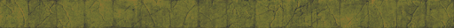

## Zipping around

The most basic feature of this mod is the floor tiles known as copper-floor, which gives better bonus than concrete for speed movement bonus. Each successive tier(Level 1:  , Level 2: [copper-floor2](graphics/copper-floor/concrete1_level2.png) , Level 3: [copper-floor3](graphics/copper-floor/concrete1_level3.png)  ) of copper floors give better bonus movement.

However, to truly take advantage of copper floors, you'll need to build out the infrastructure to allowed automated movements.

To do this, you must equip yourself with a hoverboard, build out the pathways, directives to control movement, and accelerators to charge your hoverboard.

**To turn on active navigation** - If the hoverboard status is inactive, click on the button to turn it active. This will allow active navigation.

Make sure that you are equipped with a hoverboard in your armor's module inventory.

To start with, your hoverboard has a charge of zero, meaning that it will not move you. If you do have a charge, it will tick down to zero every tick, or that you are no longer on any conductive flooring.

You must place an accelerator to charge your hoverboard. This will give you an additional twenty charges.

Use directive tiles to direct the movement of your hoverboard.

## Copyright Notice

Code and graphics by kiba is copyrighted under MIT, unless otherwise noted. Factorio art assets used or modified in this mod belongs to their respective copyright owner, and is not under the MIT.
