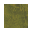
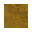

## Introduction

MagneticFloor is a mod that adds a totally new gameplay, allowing for automation of player movements (and vehicles in the future), based on the conceit of using magnetic levitation to float.

The most basic feature of this mod is the floor tiles known as copper-floor, which gives better bonus than concrete for speed movement bonus. Each successive tier(Level 1:  , Level 2:  , Level 3:   ) of copper floors give better bonus movement.

Beyond that, to truly take advantage of this mod, you'll need to build out the infrastructure to allow automated movement.

To do this, you must equip yourself with a hoverboard, build out the pathways, place directives to control movement, and accelerators to charge your hoverboard.

Below is a tutorial on how to do exactly that.

First, ensure that a hoverboard is equipped with your power armor and that you are wearing it. Otherwise, the hoverboard will not activate.

If the hoverboard status indicated inactive, click on the button to turn on active navigation. Otherwise, it is off, disallowing any possibility of automated movement.

To start with, your hoverboard has a charge of zero, meaning that it will not move you. If you do have a charge, it will tick down to zero every tick, or that you are no longer on any conductive flooring.

You must place an accelerator to charge your hoverboard. This will give you an additional twenty charges.

Use directive tiles to direct the movement of your hoverboard.

## Copyright Notice

Code and graphics by kiba is copyrighted under the MIT license, unless otherwise noted. Factorio art assets used or modified in this mod belongs to their respective copyright owner, and is not under the MIT.
